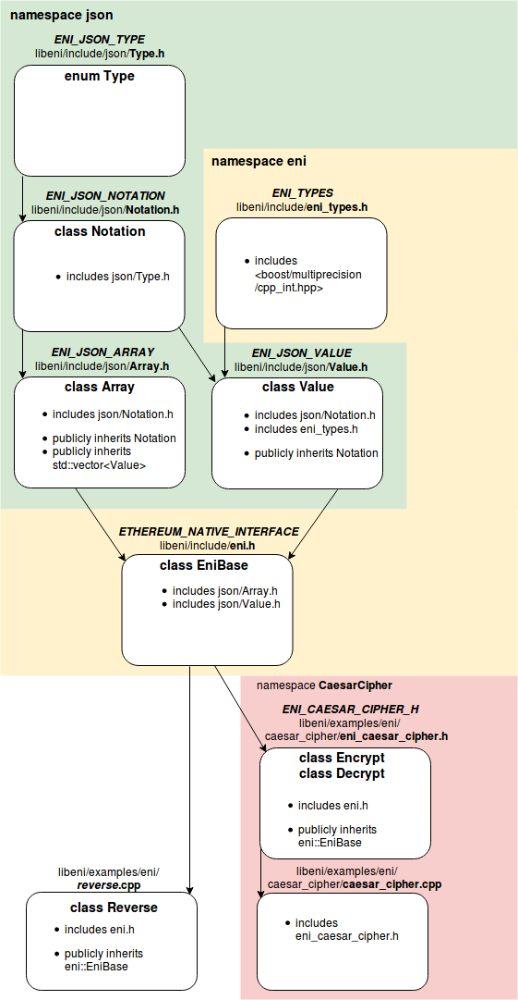

======================
Contributing to libENI
======================

See `Getting Started <docs/getting-started.rst>`_ for how to build libENI.

Overview of libENI Code
-----------------------

The following image illustrates the libENI code hierarchy and the use of namespaces.



Directory Structure
```````````````````

============== =================================================
Path           Description
-------------- -------------------------------------------------
docs/          Documentations.
examples/      Examples of how to use libENI.
include/       Header files for libENI.
lib/           Implementations for libENI.
test/          All tests for libENI and its examples.
tools/         Tools and modules for libENI.
============== =================================================

Report an Issue
---------------

Please provide the following information as much as possible.

* The version (commit-ish) your using.
* Your platform, environment setup, etc.
* Steps to reproduce the issue.
* Your expected result of the issue.
* Current result of the issue.

Create a Pull Request
---------------------

* Fork from the `master` branch.
* Avoid to create merge commits when you update from `master` by using
  ``git rebase`` or ``git pull --rebase`` (instead of ``git merge``).
* Add test cases for your pull request if you're proposing new features or
  major bug fixes.
* Build and test locally before submit your pull request.
  See `Getting Started <docs/getting-started.rst>`_ for how to test libENI.

Please try to follow the existing coding style of libENI (although it is neither
well-styled nor documented at this moment), which is basically based on
`LLVM coding standards <https://llvm.org/docs/CodingStandards.html>`_.
